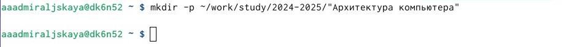
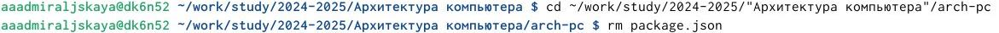

---
## Front matter
title: "ОТЧЁТ ПО ЛАБОРАТОРНОЙ РАБОТЕ № 2."
subtitle: "дисциплина: Архитектура компьютера"
author: "Адмиральская Александра Андреевна"

## Generic otions
lang: ru-RU
toc-title: "Содержание"

## Bibliography
bibliography: bib/cite.bib
csl: pandoc/csl/gost-r-7-0-5-2008-numeric.csl

## Pdf output format
toc: true # Table of contents
toc-depth: 2
lof: true # List of figures
lot: true # List of tables
fontsize: 12pt
linestretch: 1.5
papersize: a4
documentclass: scrreprt
## I18n polyglossia
polyglossia-lang:
  name: russian
  options:
	- spelling=modern
	- babelshorthands=true
polyglossia-otherlangs:
  name: english
## I18n babel
babel-lang: russian
babel-otherlangs: english
## Fonts
mainfont: IBM Plex Serif
romanfont: IBM Plex Serif
sansfont: IBM Plex Sans
monofont: IBM Plex Mono
mathfont: STIX Two Math
mainfontoptions: Ligatures=Common,Ligatures=TeX,Scale=0.94
romanfontoptions: Ligatures=Common,Ligatures=TeX,Scale=0.94
sansfontoptions: Ligatures=Common,Ligatures=TeX,Scale=MatchLowercase,Scale=0.94
monofontoptions: Scale=MatchLowercase,Scale=0.94,FakeStretch=0.9
mathfontoptions:
## Biblatex
biblatex: true
biblio-style: "gost-numeric"
biblatexoptions:
  - parentracker=true
  - backend=biber
  - hyperref=auto
  - language=auto
  - autolang=other*
  - citestyle=gost-numeric
## Pandoc-crossref LaTeX customization
figureTitle: "Рис."
tableTitle: "Таблица"
listingTitle: "Листинг"
lofTitle: "Список иллюстраций"
lotTitle: "Список таблиц"
lolTitle: "Листинги"
## Misc options
indent: true
header-includes:
  - \usepackage{indentfirst}
  - \usepackage{float} # keep figures where there are in the text
  - \floatplacement{figure}{H} # keep figures where there are in the text
---

# Цель работы

Целью работы является изучение идеологии и применения средств контроля
версий и приобретение практических навыков работы с git.

# Задание

1. Техническое обеспечение
1) Настройка github
2) Базовая настройка git
3) Создания SSH ключа
4) Создание рабочего пространства и репозитория курса на основе шаблона
5) Создание репозитория курса на основе шаблона
6) Настройка каталога курса
2. Задание для самостоятельной работы
В ходе выполнения лабораторной работы предстоит создать отчёт в
соответствующем каталоге рабочего пространства (labs>lab02>report) и
скопировать отчеты по выполнению предыдущих лабораторных работ в
соответствующие каталоги, а затем загрузить все файлы на GitHub.

# Выполнение лабораторной работы

 Для начала создаем учётную запись на сайте https://github.com/ и заполняем
основные данные (рис. [-@fig:001]).

{#fig:001 width=70%}

 Сначала сделаем предварительную конфигурацию git, указав имя и email
владельца репозитория (рис. [-@fig:002]).

{#fig:002 width=70%}

 Настроим utf-8 в выводе сообщений git, зададим имя начальной ветке (будем
называть её master), укажем значение параметров autocrlf и safecrlf (рис. [-@fig:003]).

{#fig:003 width=70%}

 Для последующей идентификации пользователя на сервере репозиториев
сгенерируем пару ключей (приватный и открытый) (рис. [-@fig:004]).

{#fig:004 width=70%}

  Далее загружаем сгенерированный открытый ключ на Github, предварительно
скопировав в буфер обмена (рис. [-@fig:005]).

{#fig:005 width=70%}

  Загружаем ключ на Github. (рис. [-@fig:006]).

{#fig:006 width=70%}

 Далее создаем каталог для предмета «Архитектура компьютера» (рис. [-@fig:007]).

{#fig:007 width=70%}

 Через web-интерфейс github создадим репозиторий на основе шаблона, указав
имя study_2024–2025_arh-рс (рис. [-@fig:008]).

{#fig:008 width=70%}

 Перейдем в каталог курса и скопируем в него созданный репозиторий с
помощью ссылки для клонирования (рис. [-@fig:009]).

{#fig:009 width=70%}

 Клонируем репозитоий (рис. [-@fig:010]).

{#fig:010 width=70%}

  Перейдём в каталог курса и удалим лишние файлы (рис. [-@fig:011]).

{#fig:011 width=70%}

 Создадим нужные файлы (рис. [-@fig:012]).

{#fig:012 width=70%}

  Отправим файлы на сервер (рис. [-@fig:013]).

{#fig:013 width=70%}

  Проверим правильность введённых команд (рис. [-@fig:014]).

{#fig:014 width=70%}

 Приступим к выполнению заданий для самостоятельной работы.
Скопируем отчёты по выполнению прошлых лабораторных работ и переместим
отчет по выполнению данной лабораторной работы в соответствующих
каталогах рабочего пространства (рис. [-@fig:015]).

{#fig:015 width=70%}

 Проверим файлы на сервере (рис. [-@fig:016]).

{#fig:016 width=70%}
  
 Проверим файлы на сервере (рис. [-@fig:017]).
  
{#fig:017 width=70%}

# Выводы

 В процессе выполнения этой лабораторной работы я изучила идеологию и
применение средств контроля версий, а также приобрела практические навыки по
работе с системой git.

# Список литературы{.unnumbered}

::: {#refs}
:::
