---
## Front matter
title: "Отчёт по лабораторной работе №4"
subtitle: "Дисциплина: архитектура компьютера"
author: "Адмиральская Александра Андреевна"

## Generic otions
lang: ru-RU
toc-title: "Содержание"

## Bibliography
bibliography: bib/cite.bib
csl: pandoc/csl/gost-r-7-0-5-2008-numeric.csl

## Pdf output format
toc: true # Table of contents
toc-depth: 2
lof: true # List of figures
lot: true # List of tables
fontsize: 12pt
linestretch: 1.5
papersize: a4
documentclass: scrreprt
## I18n polyglossia
polyglossia-lang:
  name: russian
  options:
	- spelling=modern
	- babelshorthands=true
polyglossia-otherlangs:
  name: english
## I18n babel
babel-lang: russian
babel-otherlangs: english
## Fonts
mainfont: IBM Plex Serif
romanfont: IBM Plex Serif
sansfont: IBM Plex Sans
monofont: IBM Plex Mono
mathfont: STIX Two Math
mainfontoptions: Ligatures=Common,Ligatures=TeX,Scale=0.94
romanfontoptions: Ligatures=Common,Ligatures=TeX,Scale=0.94
sansfontoptions: Ligatures=Common,Ligatures=TeX,Scale=MatchLowercase,Scale=0.94
monofontoptions: Scale=MatchLowercase,Scale=0.94,FakeStretch=0.9
mathfontoptions:
## Biblatex
biblatex: true
biblio-style: "gost-numeric"
biblatexoptions:
  - parentracker=true
  - backend=biber
  - hyperref=auto
  - language=auto
  - autolang=other*
  - citestyle=gost-numeric
## Pandoc-crossref LaTeX customization
figureTitle: "Рис."
tableTitle: "Таблица"
listingTitle: "Листинг"
lofTitle: "Список иллюстраций"
lotTitle: "Список таблиц"
lolTitle: "Листинги"
## Misc options
indent: true
header-includes:
  - \usepackage{indentfirst}
  - \usepackage{float} # keep figures where there are in the text
  - \floatplacement{figure}{H} # keep figures where there are in the text
---

# Цель работы

Освоение процедуры компиляции и сборки программ, написанных на ассемблере NASM.

# Задание

1.Создание программы Hello world!
2.Работа с транслятором NASM
3.Работа с расширенным синтаксисом командной строки NASM
4.Работа с компоновщиком LD
5.Запуск исполняемого файла
6.Выполнение заданий для самостоятельной работы.

# Выполнение лабораторной работы

Для начала создаем каталог для работы с программами на языке ассемблера NASM и переходим в него (рис. [-@fig:001]).

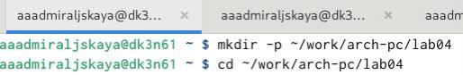{#fig:001 width=70%}

Далее создаем текстовый файл с именем hello.asm и открываем файл с помощью текстового редактора gedit (рис. [-@fig:002]).

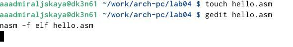{#fig:002 width=70%} 

Вводим в файле текст (рис. [-@fig:003]).

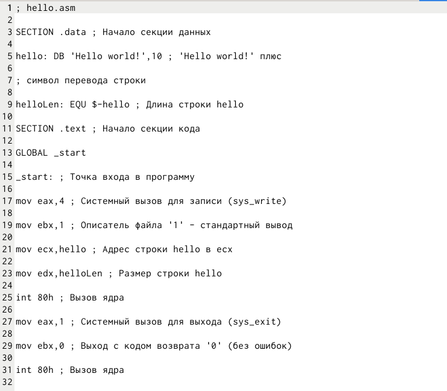{#fig:003 width=70%}

Превращаем текст программы для вывода "Hello world!" в объектный код с помощью транслятора NASM, используя команду nasm -f elf hello.asm (рис. [-@fig:004]).

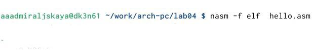{#fig:004 width=70%}

Затем передаем объектный файл на обработку компоновщику и запускаем на выполнение созданный исполняемый файл (рис. [-@fig:005]).

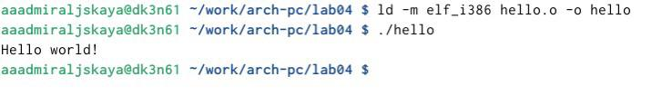{#fig:005 width=70%}

Приступим к выполнению заданий для самостоятельной работы. С помощью команды cp создаем копию файла
hello.asm с именем lab4.asm (рис. [-@fig:006]).

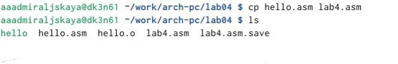{#fig:006 width=70%}

Используя текстовый редактор gedit, вносим изменения в текст программы так, чтобы вместо Hello world! на экран выводилась строка с моими фамилией и именем (рис. [-@fig:007]).

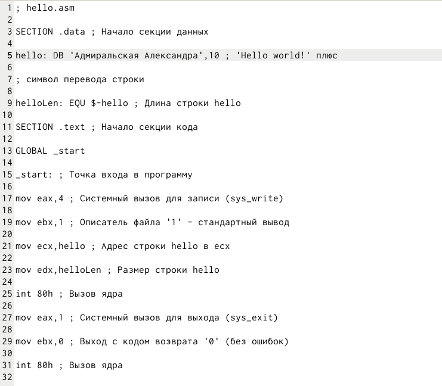{#fig:007 width=70%}

Затем транслируем полученный текст программы lab4.asm в объектный файл (рис. [-@fig:008]).

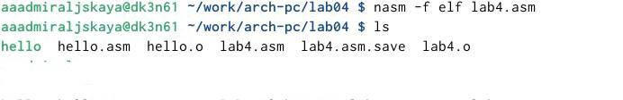{#fig:008 width=70%}

Выполняем компоновку объектного файла и запускаем получившийся исполняемый файл (рис. [-@fig:009]).

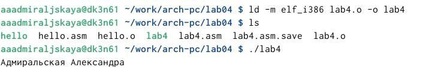{#fig:009 width=70%}

Далее копируем файлы hello.asm и lab4.asm в локальный репозиторий в ката-
лог ~/work/study/2024-2025/"Архитектура компьютера"/arch-pc/labs/lab04/ (рис. [-@fig:010]).

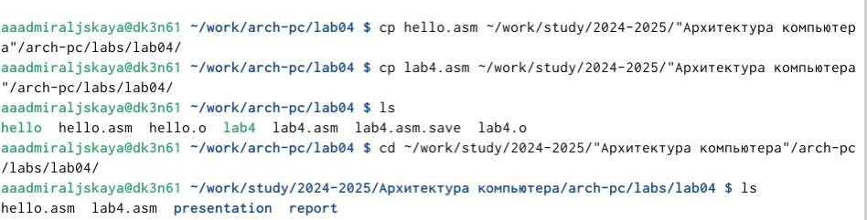{#fig:010 width=70%}

Последним шагом загружаем файлы на Github (рис. [-@fig:011]).

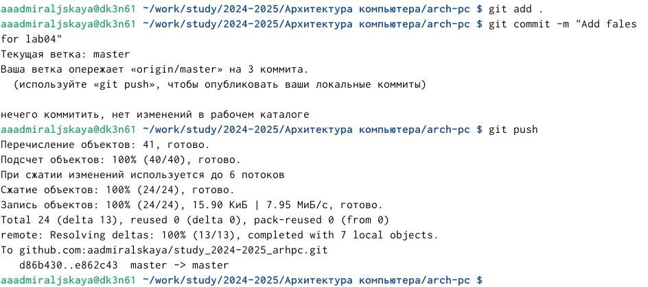{#fig:011 width=70%}

# Выводы

При выполнении данной лабораторной работы я освоила процедуры компиляции и сборки программ, написанных на ассемблере NASM.

