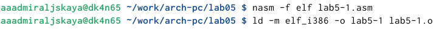
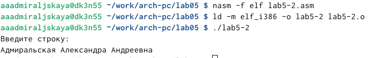

---
## Front matter
title: "Отчет по лабораторной работе №5"
subtitle: "Дисциплина: архитектура компьютера"
author: "Адмиральская Александра Андреевна"

## Generic otions
lang: ru-RU
toc-title: "Содержание"

## Bibliography
bibliography: bib/cite.bib
csl: pandoc/csl/gost-r-7-0-5-2008-numeric.csl

## Pdf output format
toc: true # Table of contents
toc-depth: 2
lof: true # List of figures
lot: true # List of tables
fontsize: 12pt
linestretch: 1.5
papersize: a4
documentclass: scrreprt
## I18n polyglossia
polyglossia-lang:
  name: russian
  options:
	- spelling=modern
	- babelshorthands=true
polyglossia-otherlangs:
  name: english
## I18n babel
babel-lang: russian
babel-otherlangs: english
## Fonts
mainfont: IBM Plex Serif
romanfont: IBM Plex Serif
sansfont: IBM Plex Sans
monofont: IBM Plex Mono
mathfont: STIX Two Math
mainfontoptions: Ligatures=Common,Ligatures=TeX,Scale=0.94
romanfontoptions: Ligatures=Common,Ligatures=TeX,Scale=0.94
sansfontoptions: Ligatures=Common,Ligatures=TeX,Scale=MatchLowercase,Scale=0.94
monofontoptions: Scale=MatchLowercase,Scale=0.94,FakeStretch=0.9
mathfontoptions:
## Biblatex
biblatex: true
biblio-style: "gost-numeric"
biblatexoptions:
  - parentracker=true
  - backend=biber
  - hyperref=auto
  - language=auto
  - autolang=other*
  - citestyle=gost-numeric
## Pandoc-crossref LaTeX customization
figureTitle: "Рис."
tableTitle: "Таблица"
listingTitle: "Листинг"
lofTitle: "Список иллюстраций"
lotTitle: "Список таблиц"
lolTitle: "Листинги"
## Misc options
indent: true
header-includes:
  - \usepackage{indentfirst}
  - \usepackage{float} # keep figures where there are in the text
  - \floatplacement{figure}{H} # keep figures where there are in the text
---

# Цель работы

Приобретение практических навыков работы в Midnight Commander. Освоение инструкций
языка ассемблера mov и int.

# Задание

    1.Основы работы с mc
    2.Структура программы на языке ассемблера NASM
    3.Подключение внешнего файла
    4.Выполнение заданий для самостоятельной работы

# Теоретическое введение

Здесь описываются теоретические аспекты, связанные с выполнением работы.

Например, в табл. [-@tbl:std-dir] приведено краткое описание стандартных каталогов Unix.

: Описание некоторых каталогов файловой системы GNU Linux {#tbl:std-dir}

| Имя каталога | Описание каталога                                                                                                          |
|--------------|----------------------------------------------------------------------------------------------------------------------------|
| `/`          | Корневая директория, содержащая всю файловую                                                                               |
| `/bin `      | Основные системные утилиты, необходимые как в однопользовательском режиме, так и при обычной работе всем пользователям     |
| `/etc`       | Общесистемные конфигурационные файлы и файлы конфигурации установленных программ                                           |
| `/home`      | Содержит домашние директории пользователей, которые, в свою очередь, содержат персональные настройки и данные пользователя |
| `/media`     | Точки монтирования для сменных носителей                                                                                   |
| `/root`      | Домашняя директория пользователя  `root`                                                                                   |
| `/tmp`       | Временные файлы                                                                                                            |
| `/usr`       | Вторичная иерархия для данных пользователя                                                                                 |

Более подробно про Unix см. в [@tanenbaum_book_modern-os_ru; @robbins_book_bash_en; @zarrelli_book_mastering-bash_en; @newham_book_learning-bash_en].

# Выполнение лабораторной работы

Для начала открывваем Midnight Commander с помощью команды mc (рис. [-@fig:001]).

{#fig:001 width=70%}

Затем переходим в каталаог ~/work/arch-pc созданный при выполнении лабораторной работы №4 (рис. [-@fig:002]).

{#fig:002 width=70%}

С помощью клавиши F7 создаем папку lab05 и переходим в этот каталог (рис. [-@fig:003]).

{#fig:003 width=70%}

Пользуясь строкой ввода и командой touch создаем файл lab5-1.asm (рис. [-@fig:004]).

{#fig:004 width=70%}

С помощью функциональной клавиши F4 открываем созданный файл и вводим текст программы для запроса строки у пользователя (рис. [-@fig:005]).

{#fig:005 width=70%}

При помощи клавиши F3 открываем файл lab5-1.asm для просмотра и убеждаемся, что файл содержит текст программы (рис. [-@fig:006]).

{#fig:006 width=70%}

Транслируем текст программы файла в объектный файл командой nasm -f elf lab5-1.asm. Создался объектный файл lab5-1.o. Выполняем компоновку объектного файла с помощью команды ld -m elf_i386 -o lab5-1 lab5-1.o. Создался исполняемый файл lab5-1 (рис. [-@fig:007]).

{#fig:007 width=70%}

Запускаем получившийся исполняемый файл. Программа выводит строку 'Введите строку:' и мы вводим свое ФИО (рис. [-@fig:008]).

{#fig:008 width=70%}

Скачиваем файл in_out.asm со страницы курса в ТУИС. Он сохранился в каталог "Загрузки" (рис. [-@fig:009]).

{#fig:009 width=70%}

С помощью функциональной клавиши F5 копируем файл in_out.asm из каталога Загрузки в созданный каталог lab05 (рис. [-@fig:010]).

{#fig:010 width=70%}

С помощью функциональной клавиши F5 копируем файл lab5-1 в тот же каталог, но с другим именем, для этого в появившемся окне mc прописываем имя для копии файла (рис. [-@fig:011]).

{#fig:011 width=70%}

Изменяем содержимое файла lab5-2.asm во встроенном редакторе nano, чтобы в программе использовались подпрограммы из внешнего файла in_out.asm (рис. [-@fig:012]).

{#fig:012 width=70%}

Транслируем текст программы файла в объектный файл командой nasm -f elf lab5-2.asm. Создался объектный файл lab5-2.o. Выполняем компоновку объектного файла с помощью команды ld -m elf_i386 -o lab5-2 lab5-2.o Создался исполняемый файл lab5-2. Запускаем исполняемый файл (рис. [-@fig:013]).

{#fig:013 width=70%}

Открываем файл lab5-2.asm для редактирования в nano функциональной клавишей F4. Изменяем в нем подпрограмму sprintLF на sprint (рис. [-@fig:014]).

{#fig:014 width=70%}

Снова транслируем файл, выполняем компоновку созданного объектного файла, запускаем новый исполняемый файл (рис. [-@fig:015]). Разница между файлами lab5-2 и lab5-2-2 в том, что запуск первого исполняемого файла запрашивает ввод с новой строки, а программа, используемая при запуске второго файла, запрашивает ввод без переноса на новую строку. В этом и заключается различие между подпрограммами sprintLF и sprint.

{#fig:015 width=70%}

Приступим к выполнению заданий для самостоятельной работы. 
1) Создаем копию файла lab5-1.asm с именем lab5-1-1.asm (рис. [-@fig:016]).

{#fig:016 width=70%}

С помощью функциональной клавиши F4 открываем созданный файл для редактирования. Изменяем программу так, чтобы кроме вывода приглашения и запроса ввода, она выводила вводимую пользователем строку (рис. [-@fig:017]).

{#fig:017 width=70%}

Код измененной программы из пункта 1):

;------------------------------------------------------------------
; Программа вывода сообщения на экран и ввода строки с клавиатуры
;------------------------------------------------------------------
;------------------- Объявление переменных ----------------
SECTION .data ; Секция инициированных данных
msg: DB 'Введите строку:',10
; символ перевода строки
msgLen: EQU $-msg ; Длина переменной 'msg'
SECTION .bss ; Секция не инициированных данных
buf1: RESB 80 ; Буфер размером 80 байт
;------------------- Текст программы -----------------
SECTION .text ; Код программы
GLOBAL _start ; Начало программы
_start: ; Точка входа в программу
;------------ Cистемный вызов `write`
; После вызова инструкции 'int 80h' на экран будет
; выведено сообщение из переменной 'msg' длиной 'msgLen'
mov eax,4 ; Системный вызов для записи (sys_write)
mov ebx,1 ; Описатель файла 1 - стандартный вывод
mov ecx,msg ; Адрес строки 'msg' в 'ecx'
mov edx,msgLen ; Размер строки 'msg' в 'edx'
int 80h ; Вызов ядра
;------------ системный вызов `read` ----------------------
; После вызова инструкции 'int 80h' программа будет ожидать ввода
; строки, которая будет записана в переменную 'buf1' размером 80 байт
mov eax, 3 ; Системный вызов для чтения (sys_read)
mov ebx, 0 ; Дескриптор файла 0 - стандартный ввод
mov ecx, buf1 ; Адрес буфера под вводимую строку
mov edx, 80 ; Длина вводимой строки
int 80h ; Вызов ядра
;------------ Системный вызов `exit` ----------------------
; После вызова инструкции 'int 80h' программа завершит работу
mov eax,1 ; Системный вызов для выхода (sys_exit)
mov ebx,0 ; Выход с кодом возврата 0 (без ошибок)
int 80h ; Вызов ядра

2) Создаем объектный файл lab5-1-1.o, отдаем его на обработку компоновщику, получаем исполняемый файл lab5-1-1, запускаем полученный исполняемый файл. Программа запрашивает ввод, вводим свои ФИО, далее программа выводит введенные мною данные  (рис. [-@fig:018]).

{#fig:018 width=70%}

3) Создаем копию файла lab5-2.asm с именем lab5-2-1.asm с помощью функциональной клавиши F5 (рис. [-@fig:019]).

{#fig:019 width=70%}

С помощью функциональной клавиши F4 открываем созданный файл для редактирования. Изменяем программу так, чтобы кроме вывода приглашения и запроса ввода, она выводила вводимую пользователем строку (рис. [-@fig:020]).

{#fig:020 width=70%}

Код программы из пункта 3):

;--------------------------------------------------------------------
; Программа вывода сообщения на экран и ввода строки с клавиатуры
;---------------------------------------------------------------------
%include 'in_out.asm' ; подключение внешнего файла
SECTION .data ; Секция инициированных данных
msg: DB 'Введите строку: ',0h ; сообщение
SECTION .bss ; Секция не инициированных данных
buf1: RESB 80 ; Буфер размером 80 байт
SECTION .text ; Код программы
GLOBAL _start ; Начало программы
_start: ; Точка входа в программу
mov eax, msg ; запись адреса выводимого сообщения в `EAX`
call sprint ; вызов подпрограммы печати сообщения
mov ecx, buf1 ; запись адреса переменной в `EAX`
mov edx, 80 ; запись длины вводимого сообщения в `EBX`
call sread ; вызов подпрограммы ввода сообщения
mov eax,4 ; Системный вызов для записи (sys_write)
mov ebx,1 ; Описатель файла '1' - стандартный вывод
mov ecx,buf1 ; Адрес строки buf1 в ecx
int 80h ; Вызов ядра
call quit ; вызов подпрограммы завершения

4) Создаем объектный файл lab5-2-1.o, отдаем его на обработку компоновщику, получаем исполняемый файл lab5-2-1, запускаем полученный исполняемый файл. Программа запрашивает ввод без переноса на новую строку, ввожу свои ФИО, далее программа выводит введенные мною данные  (рис. [-@fig:021]).

{#fig:021 width=70%}

# Выводы

При выполнении данной лабораторной работы я приобрела практические навыки работы в Midnight Commander, а также освоила инструкции языка ассемблера mov и int.

# Список литературы{.unnumbered}

::: {#refs}
:::
