---
## Front matter
title: "Отчет по лабораторной работе №5"
subtitle: "Дисциплина: архитектура компьютера"
author: "Адмиральская Александра Андреевна"

## Generic otions
lang: ru-RU
toc-title: "Содержание"

## Bibliography
bibliography: bib/cite.bib
csl: pandoc/csl/gost-r-7-0-5-2008-numeric.csl

## Pdf output format
toc: true # Table of contents
toc-depth: 2
lof: true # List of figures
lot: true # List of tables
fontsize: 12pt
linestretch: 1.5
papersize: a4
documentclass: scrreprt
## I18n polyglossia
polyglossia-lang:
  name: russian
  options:
	- spelling=modern
	- babelshorthands=true
polyglossia-otherlangs:
  name: english
## I18n babel
babel-lang: russian
babel-otherlangs: english
## Fonts
mainfont: IBM Plex Serif
romanfont: IBM Plex Serif
sansfont: IBM Plex Sans
monofont: IBM Plex Mono
mathfont: STIX Two Math
mainfontoptions: Ligatures=Common,Ligatures=TeX,Scale=0.94
romanfontoptions: Ligatures=Common,Ligatures=TeX,Scale=0.94
sansfontoptions: Ligatures=Common,Ligatures=TeX,Scale=MatchLowercase,Scale=0.94
monofontoptions: Scale=MatchLowercase,Scale=0.94,FakeStretch=0.9
mathfontoptions:
## Biblatex
biblatex: true
biblio-style: "gost-numeric"
biblatexoptions:
  - parentracker=true
  - backend=biber
  - hyperref=auto
  - language=auto
  - autolang=other*
  - citestyle=gost-numeric
## Pandoc-crossref LaTeX customization
figureTitle: "Рис."
tableTitle: "Таблица"
listingTitle: "Листинг"
lofTitle: "Список иллюстраций"
lotTitle: "Список таблиц"
lolTitle: "Листинги"
## Misc options
indent: true
header-includes:
  - \usepackage{indentfirst}
  - \usepackage{float} # keep figures where there are in the text
  - \floatplacement{figure}{H} # keep figures where there are in the text
---

# Цель работы

Освоение арифметических инструкций языка ассемблера NASM.

# Задание

1.Символьные и численные данные в NASM
2.Выполнение арифметических операций в NASM
3.Выполнение заданий для самостоятельной работы

# Теоретическое введение

Здесь описываются теоретические аспекты, связанные с выполнением работы.

Например, в табл. [-@tbl:std-dir] приведено краткое описание стандартных каталогов Unix.

: Описание некоторых каталогов файловой системы GNU Linux {#tbl:std-dir}

| Имя каталога | Описание каталога                                                                                                          |
|--------------|----------------------------------------------------------------------------------------------------------------------------|
| /          | Корневая директория, содержащая всю файловую                                                                               |
| /bin       | Основные системные утилиты, необходимые как в однопользовательском режиме, так и при обычной работе всем пользователям     |
| /etc       | Общесистемные конфигурационные файлы и файлы конфигурации установленных программ                                           |
| /home      | Содержит домашние директории пользователей, которые, в свою очередь, содержат персональные настройки и данные пользователя |
| /media     | Точки монтирования для сменных носителей                                                                                   |
| /root      | Домашняя директория пользователя  root                                                                                   |
| /tmp       | Временные файлы                                                                                                            |
| /usr       | Вторичная иерархия для данных пользователя                                                                                 |

Более подробно про Unix см. в [@tanenbaum_book_modern-os_ru; @robbins_book_bash_en; @zarrelli_book_mastering-bash_en; @newham_book_learning-bash_en].

# Выполнение лабораторной работы

Для начала создаем каталог для программам лабораторной работы № 6 и переходим в него  (рис. [-@fig:001]).

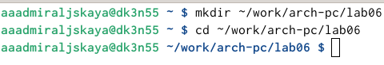{#fig:001 width=70%}

Перейдя в каталог, создаем файл lab6-1.asm (рис. [-@fig:002]).

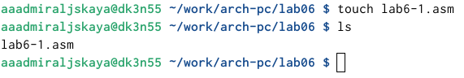{#fig:002 width=70%}

Затем копируем в текущий каталог файл in_out.asm с помощью утилиты cp, т.к. он будет использоваться в других программах (рис. [-@fig:003]).

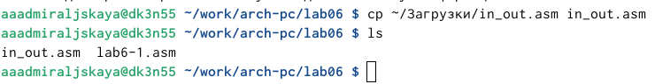{#fig:003 width=70%}

Открываем созданный файл lab6-1.asm, вставляем в него программу вывода значения регистра eax  (рис. [-@fig:004]).

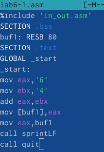{#fig:004 width=70%}

Создаем исполняемый файл и запускаем его. Программа выводит символ j (рис. [-@fig:005]).

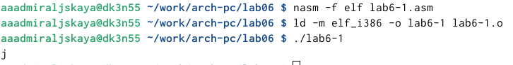{#fig:005 width=70%}

Изменяем в тексте программы символы "6" и "4" на цифры 6 и 4 (рис. [-@fig:006]).

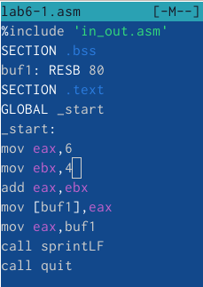{#fig:006 width=70%}

Создаем новый исполняемый файл программы и запускаем его. Теперь программа выводит символ с кодом 10, это символ перевода строки, этот символ не отображается при выводе на экран (рис. [-@fig:007]).

{#fig:007 width=70%}

Затем создаем файл lab6-2.asm в каталоге ~/work/arch-pc/lab06 (рис. [-@fig:008]).

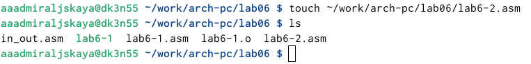{#fig:008 width=70%}

Открываем созданный файл и вводим в него текст для вывода значения регистра eax (рис. [-@fig:009]).

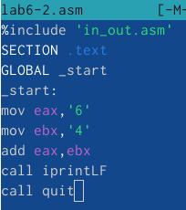{#fig:009 width=70%}

Создаем и запускаем исполняемый файл lab6-2. Программа выводит число 106 (рис. [-@fig:010]).

{#fig:010 width=70%}

Так же, как и в lab6-1.asm, заменяем в тексте программы в файле lab6-2.asm символы "6" и "4" на числа 6 и 4 (рис. [-@fig:011]).

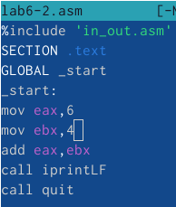{#fig:011 width=70%}

Создаем новый исполняемый файл программы и запускаем его. Теперь программа складывает не соответствующие символам коды в системе ASCII, а сами числа, поэтому вывод 10 (рис. [-@fig:012]).

{#fig:012 width=70%}

Далее открываем файл lab6-2.asm и меняем функцию iprintLF на iprint (рис. [-@fig:013]).

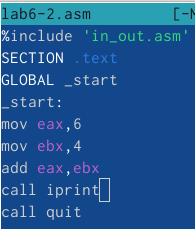{#fig:013 width=70%}

Создаем и запускаем исполняемый файл. Вывод не изменился, потому что символ переноса строки не отображался, когда программа исполнялась с функцией iprintLF, а iprint не добавляет к выводу символ переноса строки, в отличие от iprintLF (рис. [-@fig:014]).

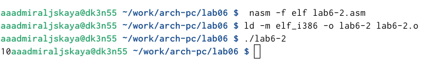{#fig:014 width=70%}

Следующим шагом создаем файл lab6-3.asm в каталоге ~/work/arch-pc/lab06 (рис. [-@fig:015]).

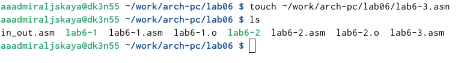{#fig:015 width=70%}

Открываем созданный файл и вводим текст программы для вычисления значения выражения f(x) = (5 * 2 + 3)/3 (рис. [-@fig:016]).

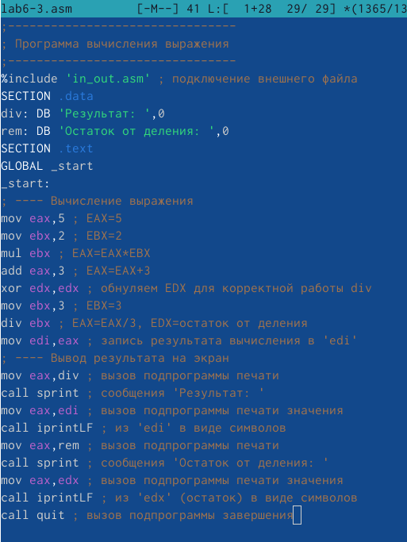{#fig:016 width=70%}

Создаем исполняемый файл и запускаем его (рис. [-@fig:017]).

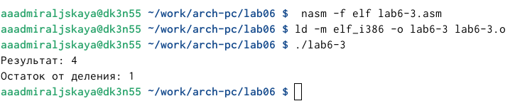{#fig:017 width=70%}

Затем в этом же файле изменяем текст программы для вычисления выражения 𝑓(𝑥) = (4 ∗ 6 + 2)/5 (рис. [-@fig:018]).

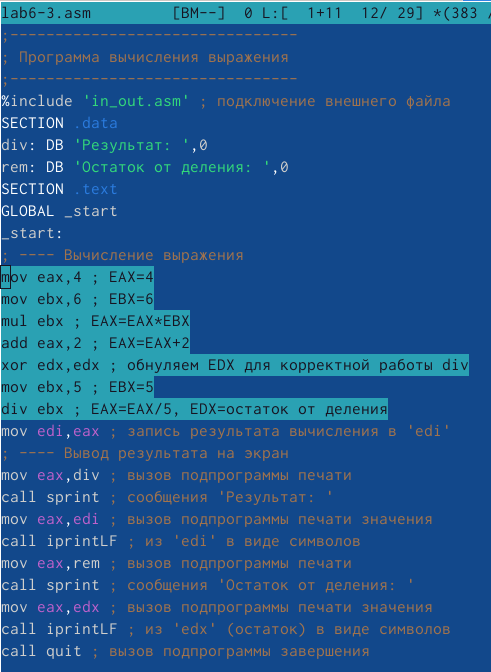{#fig:018 width=70%}

Создаем и запускаем исполняемый файл (рис. [-@fig:019]).

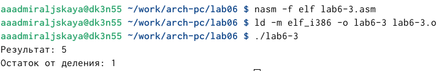{#fig:019 width=70%}

Далее создаем файл variant.asm в каталоге ~/work/arch-pc/lab06 (рис. [-@fig:020]).

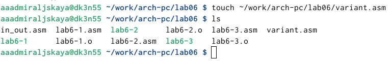{#fig:020 width=70%}

Вводим в этот файл текст программы для вычисления варианта задания по номеру студенческого билета (рис. [-@fig:021]).

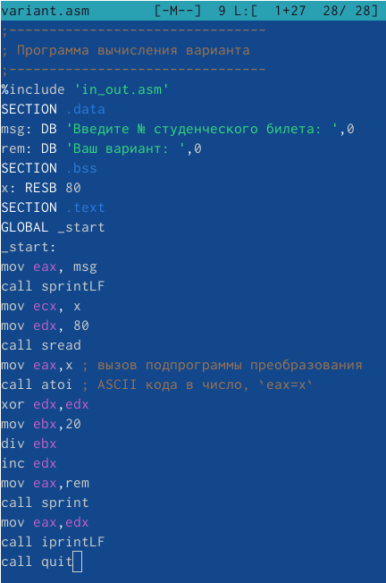{#fig:021 width=70%}

Создаем и запускаем исполняемый файл. Программа просит ввести номер студенческого билета (рис. [-@fig:022]).

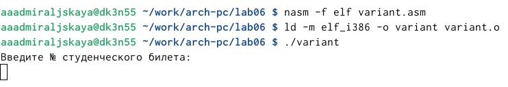{#fig:022 width=70%}

Вводим номер своего студенческого билета с клавиатуры, программа вывела, что мой вариант - 7 (рис. [-@fig:023]).

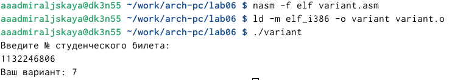{#fig:023 width=70%}

Ответы на вопросы:

1)За вывод сообщения "Ваш вариант" отвечают строки кода:

mov eax,rem
call sprint

2)Инструкция mov ecx, x используется, чтобы положить адрес вводимой строки x в регистр ecx mov edx, 80 - запись в регистр edx длины вводимой строки, call sread - вызов подпрограммы из внешнего файла, обеспечивающей ввод сообщения с клавиатуры

3)Call atoi используется для вызова подпрограммы из внешнего файла, которая преобразует ascii-код символа в целое число и записывает результат в регистр eax

4)За вычисления варианта отвечают строки:

xor edx,edx ; обнуление edx для корректной работы div
mov ebx,20 ; ebx = 20
div ebx ; eax = eax/20, edx - остаток от деления
inc edx ; edx = edx + 1

5)При выполнении инструкции div ebx остаток от деления записывается в регистр edx

6)Инструкция inc edx увеличивает значение регистра edx на 1

7)За вывод на экран результатов вычислений отвечают строки:

mov eax,edx
call iprintLF

Приступим к выполнению заданий для самостоятельной работы. Создаем файл lab6-4.asm с помощью утилиты touch (рис. [-@fig:024]).

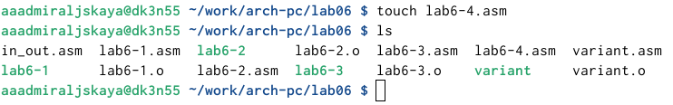{#fig:024 width=70%}

Открываем созданный файл клавишей F4. Вводим в него текст программы для вычисления значения выражения 5(𝑥 − 1)^2. Оно было под вариантом 7 (рис. [-@fig:025]).

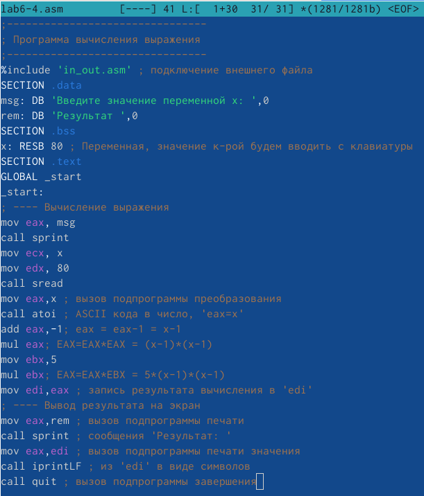{#fig:025 width=70%}

Создаем и запускаем исполняемый файл. Проверяем его работу для значения 3 - на выводе 20 и для значения 5 - на выводе 80. Все верно (рис. [-@fig:026]).

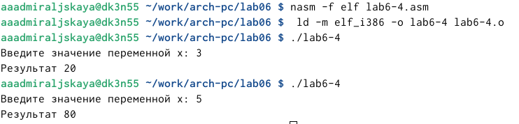{#fig:026 width=70%}

Текст программы для вычисления значения выражения 5(𝑥 − 1)^2:

;--------------------------------
; Программа вычисления выражения
;--------------------------------
%include 'in_out.asm' ; подключение внешнего файла
SECTION .data
msg: DB 'Введите значение переменной x: ',0
rem: DB 'Результат ',0
SECTION .bss
x: RESB 80 ; Переменная, значение к-рой будем вводить с клавиатуры
SECTION .text
GLOBAL _start
_start:
; ---- Вычисление выражения
mov eax, msg
call sprint
mov ecx, x
mov edx, 80
call sread
mov eax,x ; вызов подпрограммы преобразования
call atoi ; ASCII кода в число, 'eax=x'
add eax,-1; eax = eax-1 = x-1
mul eax; EAX=EAX*EAX = (x-1)*(x-1)
mov ebx,5
mul ebx; EAX=EAX*EBX = 5*(x-1)*(x-1)
mov edi,eax ; запись результата вычисления в 'edi'
; ---- Вывод результата на экран
mov eax,rem ; вызов подпрограммы печати
call sprint ; сообщения 'Результат: '
mov eax,edi ; вызов подпрограммы печати значения
call iprintLF ; из 'edi' в виде символов
call quit ; вызов подпрограммы завершения

# Выводы

При выполнении данной лабораторной работы я освоила арифметические инструкции языка ассемблера NASM.

# Список литературы{.unnumbered}

::: {#refs}
:::
