---
## Front matter
title: "Отчет по лабораторной работе №7"
subtitle: "Дисциплина: архитектура компьютера"
author: "Адмиральская Александра Андреевна"

## Generic otions
lang: ru-RU
toc-title: "Содержание"

## Bibliography
bibliography: bib/cite.bib
csl: pandoc/csl/gost-r-7-0-5-2008-numeric.csl

## Pdf output format
toc: true # Table of contents
toc-depth: 2
lof: true # List of figures
lot: true # List of tables
fontsize: 12pt
linestretch: 1.5
papersize: a4
documentclass: scrreprt
## I18n polyglossia
polyglossia-lang:
  name: russian
  options:
	- spelling=modern
	- babelshorthands=true
polyglossia-otherlangs:
  name: english
## I18n babel
babel-lang: russian
babel-otherlangs: english
## Fonts
mainfont: IBM Plex Serif
romanfont: IBM Plex Serif
sansfont: IBM Plex Sans
monofont: IBM Plex Mono
mathfont: STIX Two Math
mainfontoptions: Ligatures=Common,Ligatures=TeX,Scale=0.94
romanfontoptions: Ligatures=Common,Ligatures=TeX,Scale=0.94
sansfontoptions: Ligatures=Common,Ligatures=TeX,Scale=MatchLowercase,Scale=0.94
monofontoptions: Scale=MatchLowercase,Scale=0.94,FakeStretch=0.9
mathfontoptions:
## Biblatex
biblatex: true
biblio-style: "gost-numeric"
biblatexoptions:
  - parentracker=true
  - backend=biber
  - hyperref=auto
  - language=auto
  - autolang=other*
  - citestyle=gost-numeric
## Pandoc-crossref LaTeX customization
figureTitle: "Рис."
tableTitle: "Таблица"
listingTitle: "Листинг"
lofTitle: "Список иллюстраций"
lotTitle: "Список таблиц"
lolTitle: "Листинги"
## Misc options
indent: true
header-includes:
  - \usepackage{indentfirst}
  - \usepackage{float} # keep figures where there are in the text
  - \floatplacement{figure}{H} # keep figures where there are in the text
---

# Цель работы

Изучение команд условного и безусловного переходов. Приобретение навыков написания
программ с использованием переходов. Знакомство с назначением и структурой файла
листинга.

# Теоретическое введение

Здесь описываются теоретические аспекты, связанные с выполнением работы.

Например, в табл. [-@tbl:std-dir] приведено краткое описание стандартных каталогов Unix.

: Описание некоторых каталогов файловой системы GNU Linux {#tbl:std-dir}

| Имя каталога | Описание каталога                                                                                                          |
|--------------|----------------------------------------------------------------------------------------------------------------------------|
| `/`          | Корневая директория, содержащая всю файловую                                                                               |
| `/bin `      | Основные системные утилиты, необходимые как в однопользовательском режиме, так и при обычной работе всем пользователям     |
| `/etc`       | Общесистемные конфигурационные файлы и файлы конфигурации установленных программ                                           |
| `/home`      | Содержит домашние директории пользователей, которые, в свою очередь, содержат персональные настройки и данные пользователя |
| `/media`     | Точки монтирования для сменных носителей                                                                                   |
| `/root`      | Домашняя директория пользователя  `root`                                                                                   |
| `/tmp`       | Временные файлы                                                                                                            |
| `/usr`       | Вторичная иерархия для данных пользователя                                                                                 |

Более подробно про Unix см. в [@tanenbaum_book_modern-os_ru; @robbins_book_bash_en; @zarrelli_book_mastering-bash_en; @newham_book_learning-bash_en].

# Выполнение лабораторной работы

Для начала создаем каталог для программам лабораторной работы № 7, переходим в него и создаем файл lab7-1.asm (рис. [-@fig:001]).

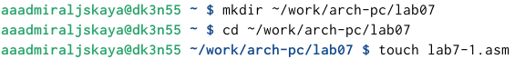{#fig:001 width=70%}

Открываем созданный файл и вводим в него текст программы из листинга 7.1. Программа выводит 2, 3 (рис. [-@fig:002]).

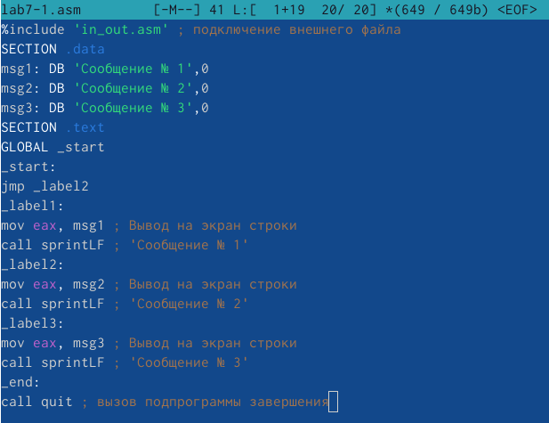{#fig:002 width=70%}

Создаем исполняемый файл и запускаем его (рис. [-@fig:003]).

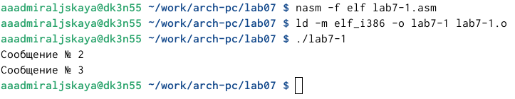{#fig:003 width=70%}

Заново открываем файл lab7-1.asm и изменяем текст программы, вывод стал 2, 1 (рис. [-@fig:004]).

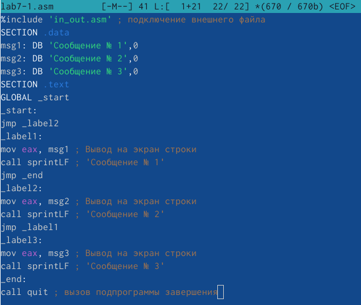{#fig:004 width=70%}

Создаем исполняемый файл и запускаем его (рис. [-@fig:005]).

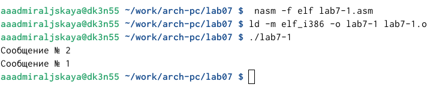{#fig:005 width=70%}

Затем изменяем текст программы в этом же файле, чтобы вывод программы был 3, 2, 1 (рис. [-@fig:006]).

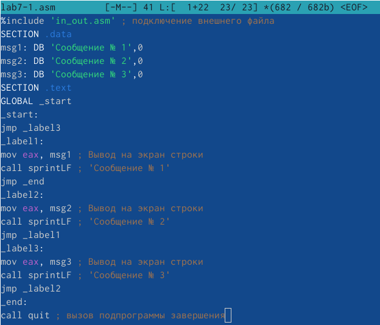{#fig:006 width=70%}

Создаем и запускаем исполняемый файл (рис. [-@fig:007]).

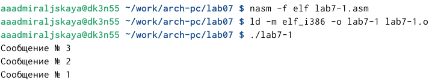{#fig:007 width=70%}

Далее создаем файл lab7-2.asm и открываем его (рис. [-@fig:008]).

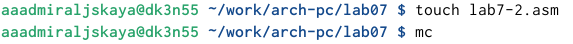{#fig:008 width=70%}

Вводим в него текст программы из листинга 7.3 (рис. [-@fig:009]).

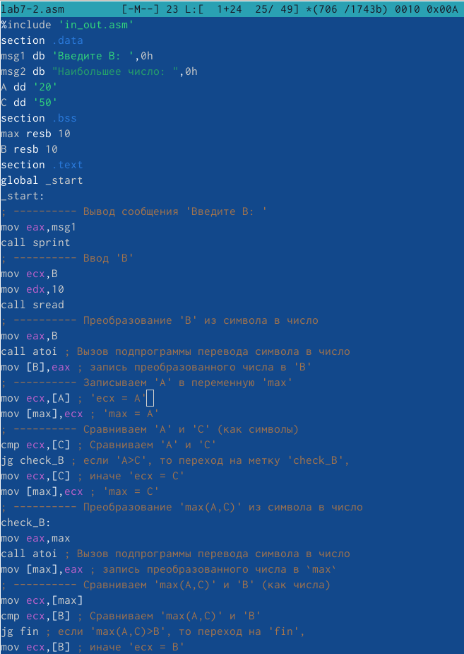{#fig:009 width=70%}

Создаем исполняемый файл и проверяем его работу для разных значений B (рис. [-@fig:010]).

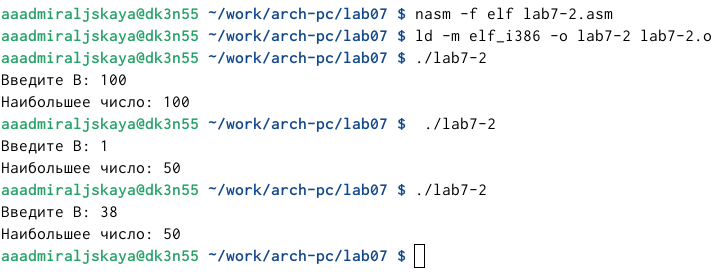{#fig:010 width=70%}

Затем создаем файл листинга для программы из файла lab7-2.asm (рис. [-@fig:011]).

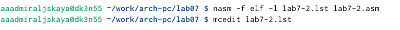{#fig:011 width=70%}

Открываем этот файл и изучаем его (рис. [-@fig:012]).

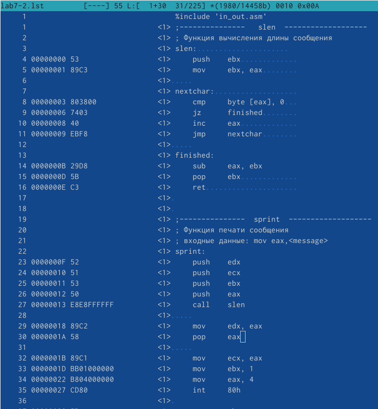{#fig:012 width=70%}

Затем открываем файл с программой lab7-2.asm и удаляем один операнд (рис. [-@fig:013]).

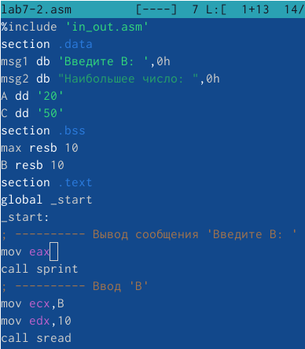{#fig:013 width=70%}

Выполняем трансляцию с получением файла листинга (рис. [-@fig:014]).

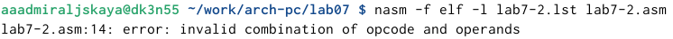{#fig:014 width=70%}

Открываем файл lab7-2.lst и проверяем на наличие ошибки (рис. [-@fig:015]).

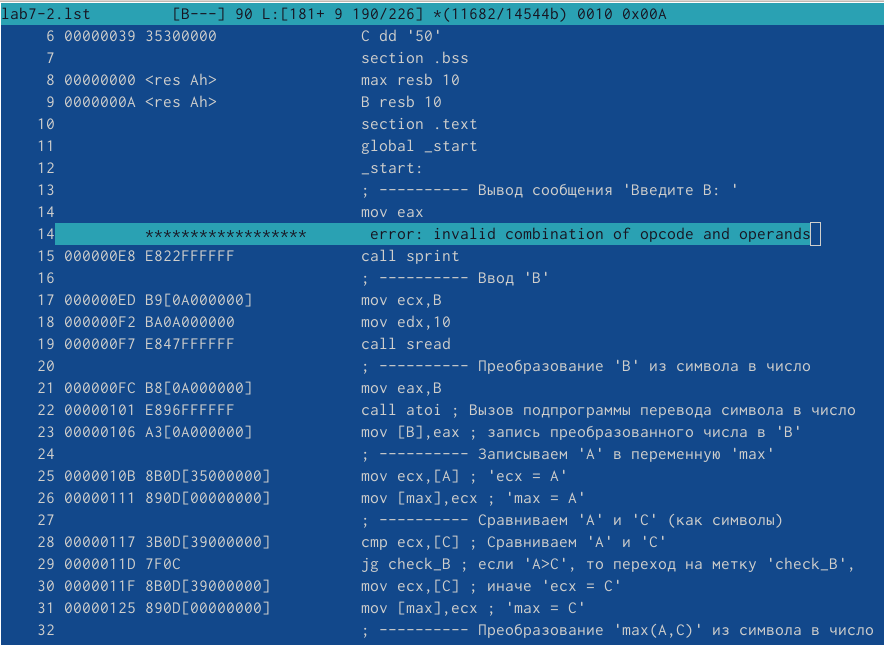{#fig:015 width=70%}

Перейдем к выполнению заданий для самостоятельной работы. Создаем файл lab7-3.asm (рис. [-@fig:016]).

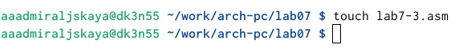{#fig:016 width=70%}

В файл вводим программу для нахождения наименьшей из 3 целочисленных переменных. Значение переменных берем из 7 варианта (рис. [-@fig:017]).

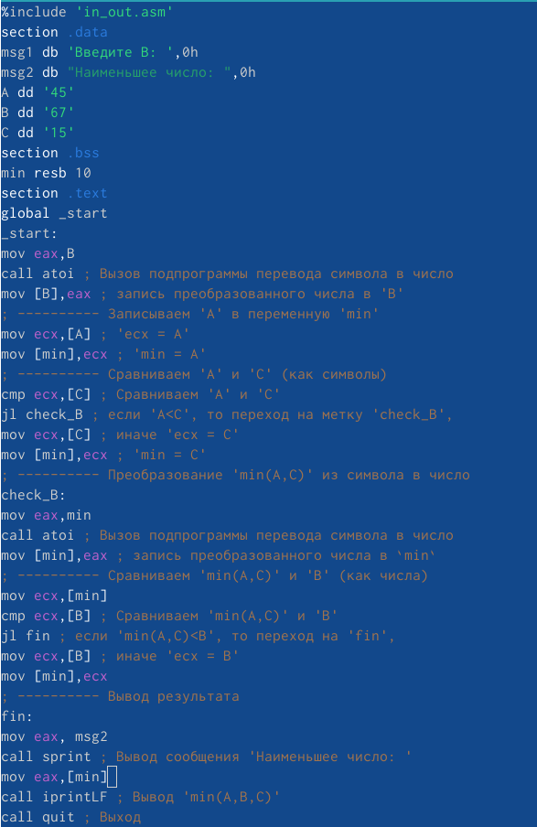{#fig:017 width=70%}

Создаем исполняемый файл и проверяем его работу. Все верно: из переменных 45, 67 и 15 - 15 является наименьшей, и на выводе мы получаем именно ее (рис. [-@fig:018]).

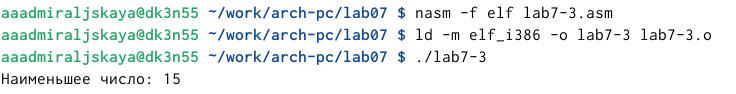{#fig:018 width=70%}

Теперь создаем файл lab7-4.asm (рис. [-@fig:019]).

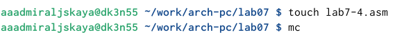{#fig:019 width=70%}

В файле пишем программу, которая для введенных с клавиатуры значений 𝑥 и 𝑎 вычисляет
значение заданной функции 𝑓(𝑥) и выводит результат вычислений. Функцию берем из 7 варианта (рис. [-@fig:020]).

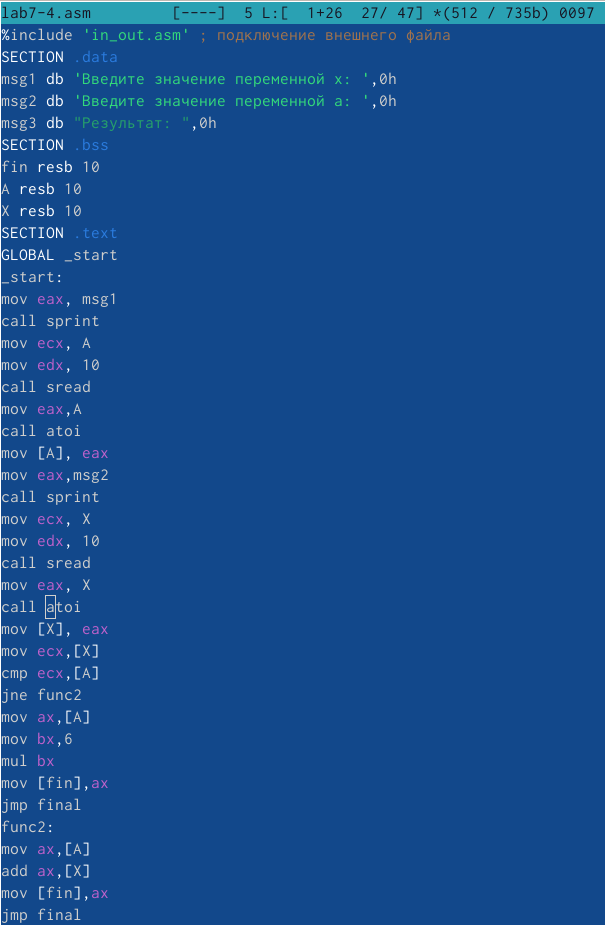{#fig:020 width=70%}

Создаем исполняемый файл и проверяем его работу для значений a,x из варианта №7: x=1, a=1 (рис. [-@fig:021]).

{#fig:021 width=70%}

Теперь проверяем его работу для значений x=2, a=1. Все верно (рис. [-@fig:022]).

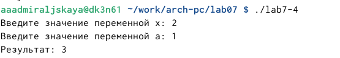{#fig:022 width=70%}

Текст программы первого задания самостоятельной работы:

%include 'in_out.asm'
section .data
msg1 db 'Введите B: ',0h
msg2 db "Наименьшее число: ",0h
A dd '45'
B dd '67'
C dd '15'
section .bss
min resb 10
section .text
global _start
_start:
mov eax,B
call atoi ; Вызов подпрограммы перевода символа в число
mov [B],eax ; запись преобразованного числа в 'B'
; ---------- Записываем 'A' в переменную 'min'
mov ecx,[A] ; 'ecx = A'
mov [min],ecx ; 'min = A'
; ---------- Сравниваем 'A' и 'С' (как символы)
cmp ecx,[C] ; Сравниваем 'A' и 'С'
jl check_B ; если 'A<C', то переход на метку 'check_B',
mov ecx,[C] ; иначе 'ecx = C'
mov [min],ecx ; 'min = C'
; ---------- Преобразование 'min(A,C)' из символа в число
check_B:
mov eax,min
call atoi ; Вызов подпрограммы перевода символа в число
mov [min],eax ; запись преобразованного числа в min
; ---------- Сравниваем 'min(A,C)' и 'B' (как числа)
mov ecx,[min]
cmp ecx,[B] ; Сравниваем 'min(A,C)' и 'B'
jl fin ; если 'min(A,C)<B', то переход на 'fin',
mov ecx,[B] ; иначе 'ecx = B'
mov [min],ecx
; ---------- Вывод результата
fin:
mov eax, msg2
call sprint ; Вывод сообщения 'Наименьшее число: '
mov eax,[min]
call iprintLF ; Вывод 'min(A,B,C)'
call quit ; Выход

Текст программы второго задания самостоятельной работы:

%include 'in_out.asm' ; подключение внешнего файла
SECTION .data
msg1 db 'Введите значение переменной x: ',0h
msg2 db 'Введите значение переменной a: ',0h
msg3 db "Результат: ",0h
SECTION .bss
fin resb 10
A resb 10
X resb 10
SECTION .text
GLOBAL _start
_start:
mov eax, msg1
call sprint
mov ecx, A
mov edx, 10
call sread
mov eax,A
call atoi
mov [A], eax
mov eax,msg2
call sprint
mov ecx, X
mov edx, 10
call sread
mov eax, X
call atoi
mov [X], eax
mov ecx,[X]
cmp ecx,[A]
jne func2
mov ax,[A]
mov bx,6
mul bx
mov [fin],ax
jmp final
func2:
mov ax,[A]
add ax,[X]
mov [fin],ax
jmp final
final:
mov eax,msg3
call sprint
mov eax,[fin]
call iprintLF
call quit

# Выводы

В процессе выполнения лабораторной работы я изучила команды условного и безусловного переходов, приобрела навыки написания программ с использованием переходов и познакомилась с назначением и структурой файла листинга.

# Список литературы{.unnumbered}

::: {#refs}
:::
