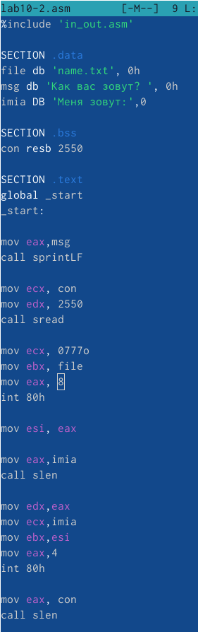

---
## Front matter
title: "Отчет по лабораторной работе №10"
subtitle: "Дисциплина: архитектура компьютера"
author: "Адмиральская Александра Андреевна"

## Generic otions
lang: ru-RU
toc-title: "Содержание"

## Bibliography
bibliography: bib/cite.bib
csl: pandoc/csl/gost-r-7-0-5-2008-numeric.csl

## Pdf output format
toc: true # Table of contents
toc-depth: 2
lof: true # List of figures
lot: true # List of tables
fontsize: 12pt
linestretch: 1.5
papersize: a4
documentclass: scrreprt
## I18n polyglossia
polyglossia-lang:
  name: russian
  options:
	- spelling=modern
	- babelshorthands=true
polyglossia-otherlangs:
  name: english
## I18n babel
babel-lang: russian
babel-otherlangs: english
## Fonts
mainfont: IBM Plex Serif
romanfont: IBM Plex Serif
sansfont: IBM Plex Sans
monofont: IBM Plex Mono
mathfont: STIX Two Math
mainfontoptions: Ligatures=Common,Ligatures=TeX,Scale=0.94
romanfontoptions: Ligatures=Common,Ligatures=TeX,Scale=0.94
sansfontoptions: Ligatures=Common,Ligatures=TeX,Scale=MatchLowercase,Scale=0.94
monofontoptions: Scale=MatchLowercase,Scale=0.94,FakeStretch=0.9
mathfontoptions:
## Biblatex
biblatex: true
biblio-style: "gost-numeric"
biblatexoptions:
  - parentracker=true
  - backend=biber
  - hyperref=auto
  - language=auto
  - autolang=other*
  - citestyle=gost-numeric
## Pandoc-crossref LaTeX customization
figureTitle: "Рис."
tableTitle: "Таблица"
listingTitle: "Листинг"
lofTitle: "Список иллюстраций"
lotTitle: "Список таблиц"
lolTitle: "Листинги"
## Misc options
indent: true
header-includes:
  - \usepackage{indentfirst}
  - \usepackage{float} # keep figures where there are in the text
  - \floatplacement{figure}{H} # keep figures where there are in the text
---

# Цель работы

Приобретение навыков написания программ для работы с файлами.

# Задание

1.Написание программ для работы с файлами
2.Выполнение самостоятельной работы

# Теоретическое введение

Здесь описываются теоретические аспекты, связанные с выполнением работы.

Например, в табл. [-@tbl:std-dir] приведено краткое описание стандартных каталогов Unix.

: Описание некоторых каталогов файловой системы GNU Linux {#tbl:std-dir}

| Имя каталога | Описание каталога                                                                                                          |
|--------------|----------------------------------------------------------------------------------------------------------------------------|
| `/`          | Корневая директория, содержащая всю файловую                                                                               |
| `/bin `      | Основные системные утилиты, необходимые как в однопользовательском режиме, так и при обычной работе всем пользователям     |
| `/etc`       | Общесистемные конфигурационные файлы и файлы конфигурации установленных программ                                           |
| `/home`      | Содержит домашние директории пользователей, которые, в свою очередь, содержат персональные настройки и данные пользователя |
| `/media`     | Точки монтирования для сменных носителей                                                                                   |
| `/root`      | Домашняя директория пользователя  `root`                                                                                   |
| `/tmp`       | Временные файлы                                                                                                            |
| `/usr`       | Вторичная иерархия для данных пользователя                                                                                 |

Более подробно про Unix см. в [@tanenbaum_book_modern-os_ru; @robbins_book_bash_en; @zarrelli_book_mastering-bash_en; @newham_book_learning-bash_en].

# Выполнение лабораторной работы

Для начала создадим каталог для программам лабораторной работы № 10, перейдем в него и
создадим файлы lab10-1.asm, readme-1.txt и readme-2.txt (рис. [-@fig:001]).

{#fig:001 width=70%}

Откроем файл lab10-1.asm и вставим в него текст программы из листинга 10.1 (рис. [-@fig:002]).

{#fig:002 width=70%}

Создадим исполняемый файл и проверим его работу (рис. [-@fig:003]).

{#fig:003 width=70%}

С помощью команды chmod изменим права доступа к исполняемому файлу lab10-1, запретив его выполнение. Выдало отказ в доступе, как и следовало ожидать, так как я просто запретила запускать программу для владельца, то есть для себя (рис. [-@fig:004]).

{#fig:004 width=70%}

С помощью команды chmod изменим права доступа к файлу lab10-1.asm с исходным текстом программы. Я дала разрешение на исполнение файлу с исходным текстом и перекомпелировала программу, она заработала, так как файл был со всеми разрешениями и до этого я запретила выполняться уже готовой программе, а это фактически новая программа которая обладает другими разрешениями, поэтому она и запустилась (рис. [-@fig:005]).

{#fig:005 width=70%}

Далее я предоставила определенные права файлу readme.txt в соответствие с вариантом 7 (рис. [-@fig:006]).

{#fig:006 width=70%}

Приступим к выполнению заданий для самостоятельной работы. Напишем программу, которая запрашивает имя и выводит его в созданном файле. Файл создает сама программа (рис. [-@fig:007]).

{#fig:007 width=70%}

Теперь создадим исполняемый файл и проверим его работу. Также проверим наличие файла и его
содержимое с помощью команд ls и cat (рис. [-@fig:008]).

{#fig:008 width=70%}

# Выводы

В процессе выполнения данной лабораторной работы я приобрела навыки написания программ для работы с файлами.

# Список литературы{.unnumbered}

::: {#refs}
:::
